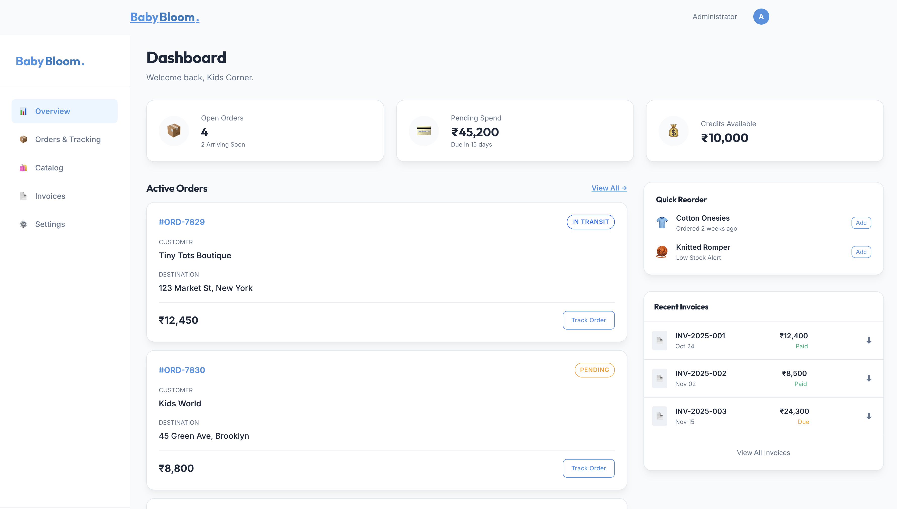

# BabyBloom Wholesale Delivery System

A modern B2B React application designed for wholesale nursery and plant delivery management. This platform connects retailers with BabyBloom's inventory, facilitating seamless ordering, tracking, and account management.



## 🚀 Features

-   **Retailer Portal**: Dedicated dashboard for retailers to browse catalogs and place bulk orders.
-   **Dynamic Catalog**: Real-time product listing with filtering, search, and detailed product views.
-   **Smart Cart & Checkout**:
    -   Integrated **Razorpay** payment gateway (Card, UPI, Net Banking).
    -   "Pay Later" option for approved credit accounts (Net-30).
    -   Automatic tax and shipping calculations.
-   **Order Management**: Track order status from placement to delivery.
-   **Authentication**:
    -   Secure login/registration flows.
    -   *Simulation Mode*: Mock OTP and Password Reset flows for demonstration.
-   **Responsive Design**: Fully responsive UI built with modern CSS variables and layouts.

## 🛠️ Tech Stack

-   **Frontend**: React.js, Vite
-   **Styling**: Plain CSS (Variables & Modules), Responsive Flexbox/Grid
-   **Routing**: React Router v6
-   **State Management**: React Context API (Auth, Cart, Orders)
-   **Payments**: Razorpay Integration
-   **Deployment**: Vercel (Serverless Functions for API)

## 📂 Project Structure

```bash
├── api/                # Vercel Serverless Functions (Backend logic)
│   ├── create-order.js
│   └── verify-payment.js
├── src/
│   ├── components/     # Reusable UI components
│   ├── context/        # Global state (Auth, Cart, products)
│   ├── pages/          # Application views
│   └── styles/         # Global styles and variables
└── vercel.json         # Deployment configuration
```

## ⚡ Getting Started

### Prerequisites

-   Node.js (v18+)
-   npm or yarn

### Installation

1.  Clone the repository:
    ```bash
    git clone https://github.com/dorothiiy/babybloom.git
    cd babybloom
    ```

2.  Install dependencies:
    ```bash
    npm install
    ```

3.  Set up Environment Variables:
    Create a `.env` file in the root directory (or set in Vercel):
    ```env
    RAZORPAY_KEY_ID=your_key_id
    RAZORPAY_KEY_SECRET=your_key_secret
    ```

4.  Run the development server:
    ```bash
    npm run dev
    ```

## 🚀 Deployment

This project is configured for **Vercel**.

1.  Push to GitHub.
2.  Import project in Vercel.
3.  Add `RAZORPAY_KEY_ID` and `RAZORPAY_KEY_SECRET` in Vercel Environment Variables.
4.  Deploy!

## 📄 License

This project is proprietary software belonging to BabyBloom.
